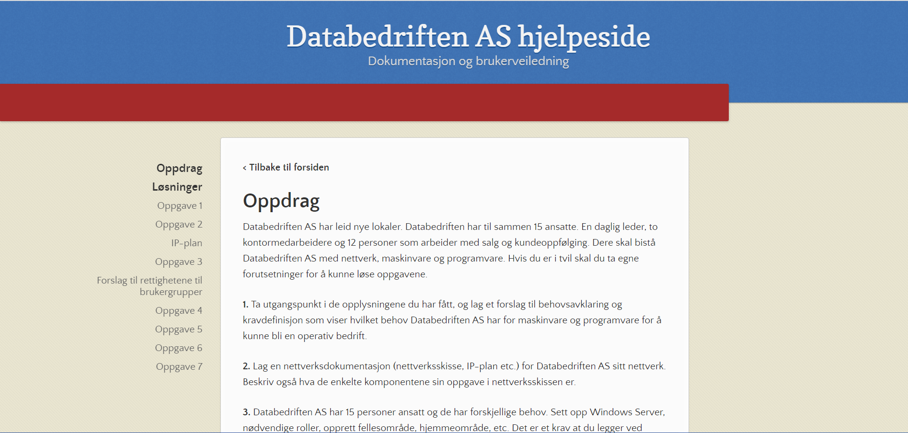

[**< Tilbake til forsiden**](index.md)

# Navigasjon på siden

## Tilbake til forside

Alle sider untatt forsiden har en `< Tilbake til forsiden` knapp, Trykk den for å returnere til forsiden.

## Til overskrift

Alle sider med overskrifter er synelig på sidemenyen, du kan trykke de for å komme dit du skal. Sider med mange overskrifter kan bla på, som f.eks. [pfsense](pfsense.md){:target="_blank"}.

## Med link

Alle linker untatt de på hovedsiden og veiledningssiden åpner en ny tabb.

