[**< Tilbake til forsiden**](index.md)

## VirtualBox

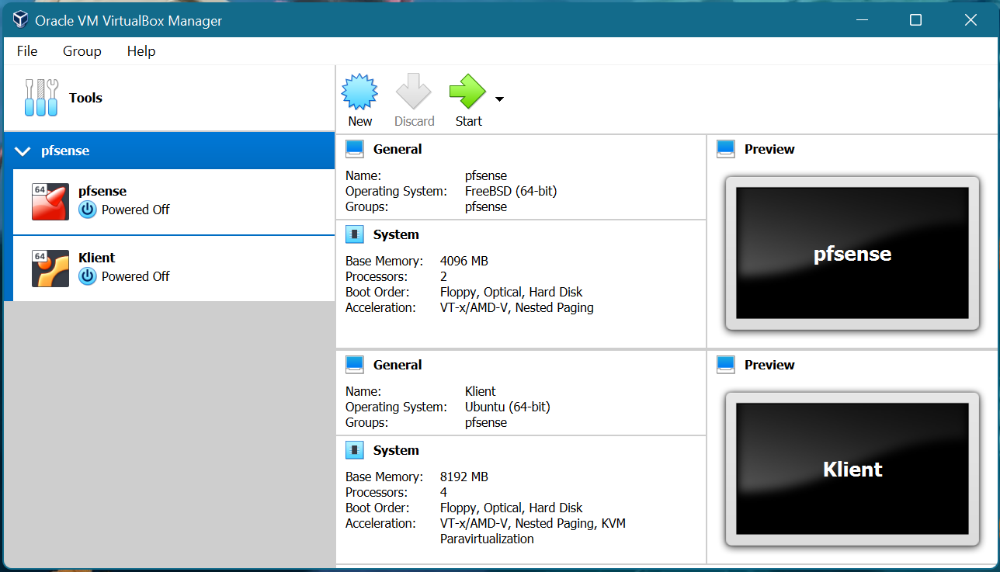

### Installasjon av VirtualBox

**Gå inn på [https://virtualbox.org](https://virtualbox.org)**

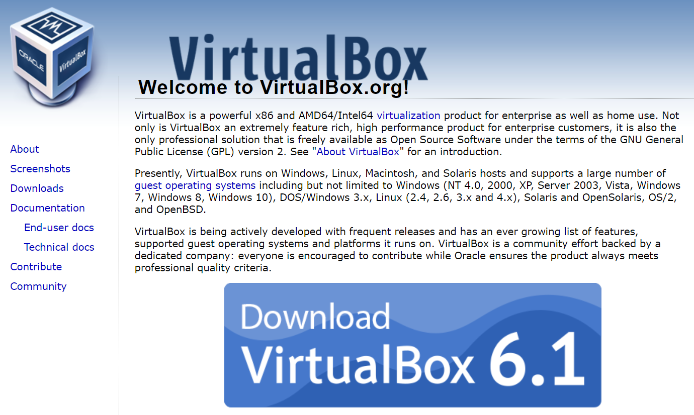

**Trykk Download VirtualBox**

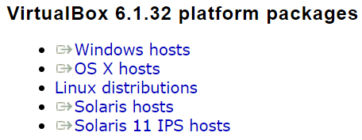

**Trykk operativsystemet du bruker**

**Kjør filen**

**Velg innstillingene du vil ha**

### Lage virtuell maskin

**Trykk New**

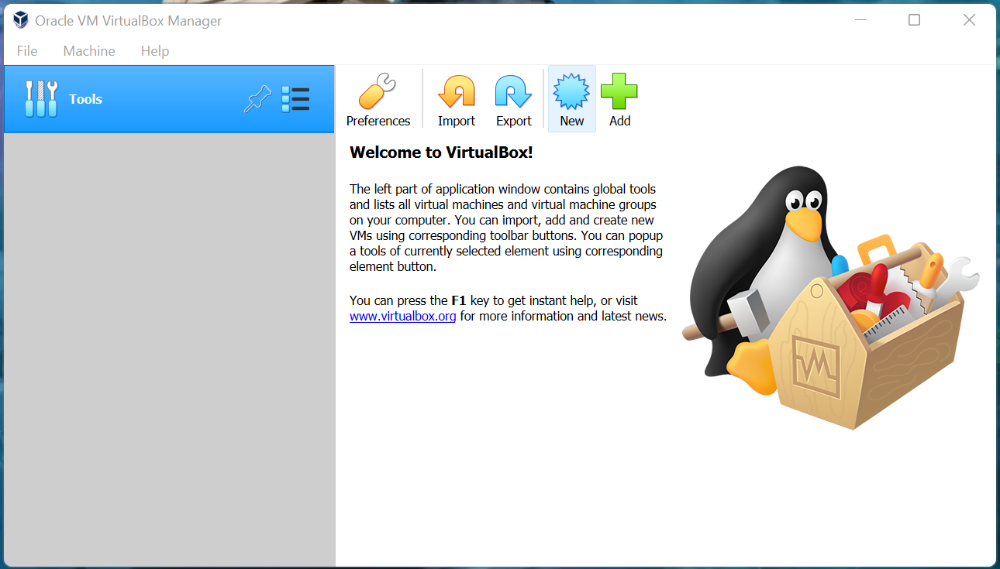

**Velg Expert Mode**

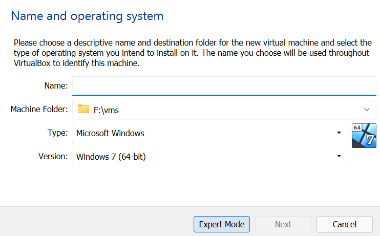

**Fyll ut navn, plassering, operativsystem og minne**

**Trykk Create**

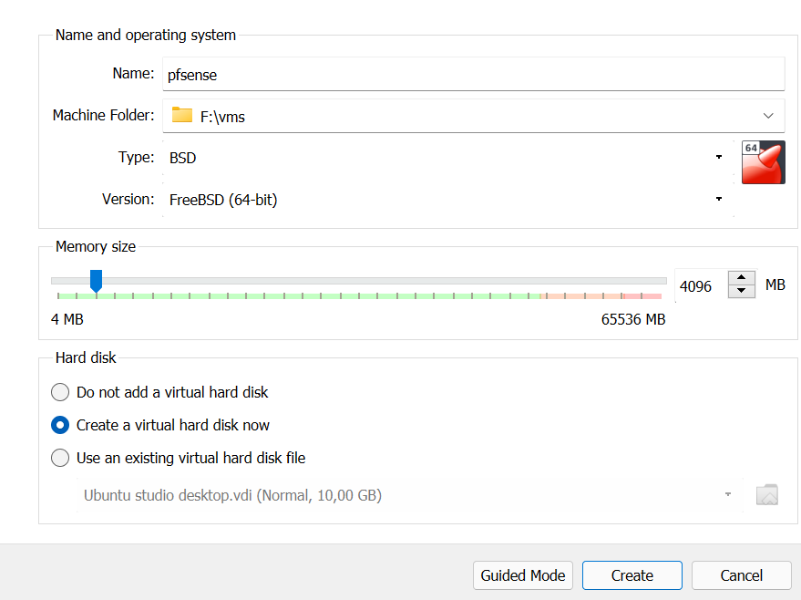

**Velg harddisk størrelse**

**Trykk Create**

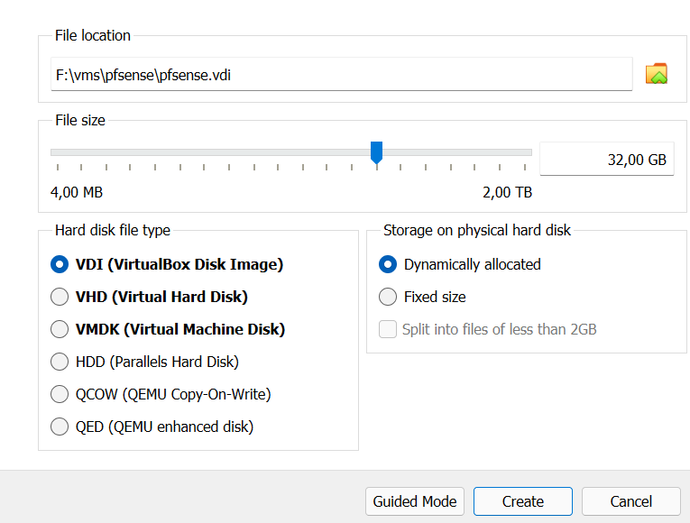

**Trykk på den tomme "IDE device"-en under storage**

**Trykk Choose a disk file...**

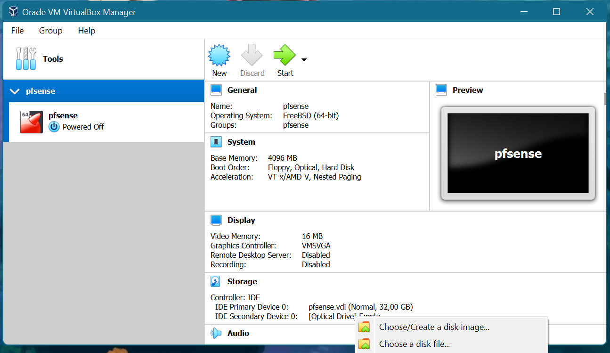

**Velg en iso-fil og trykk åpne**

**Konfigurer andre ting du trenger på maskinen f.eks. nettverk og lagring**

**Trykk Start**

### Gruppere virtuell maskin

**Høyreklikk maskinen**

**Trykk Group**

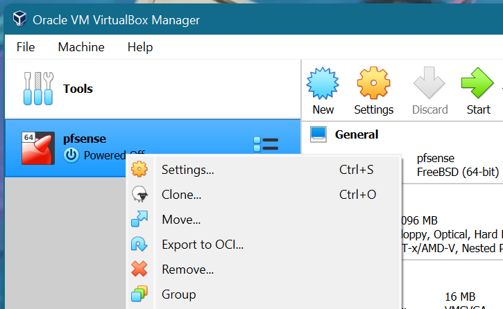

**Høyreklikk gruppen**

**Trykk Rename Group...**

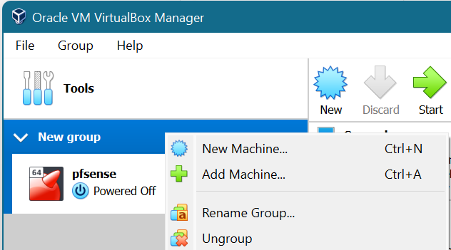

**Skriv inn nytt navn og trykk enter**

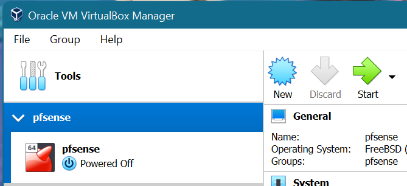

## Konfigurasjon av virtuell maskin

**Gå inn på innstillingene til maskinen**

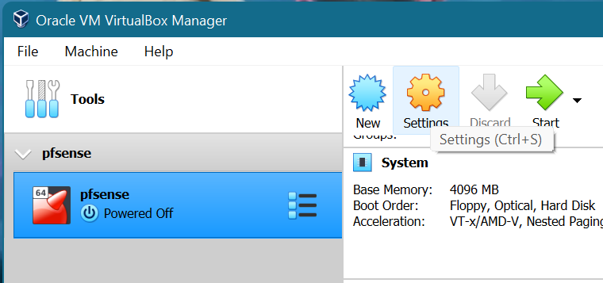

### Nettverk

**Velg Network på sidemenyen**

**Velg hvilke type nettverk du skal ha**

| Nettverkstype | Kobling                            |
| ------------- | ---------------------------------- |
| NAT           | Direkte til internett              |
| Bridge        | Til nettverket                     |
| Internal      | Til et internt nettverk            |
| Host-only     | Til maskinen som kjører VirtualBox |
| Not attached  | Ingenting                          |

_Tabell over vanlige VirtualBox nettverk_

**Legg til flere adaptere hvis du trenger**

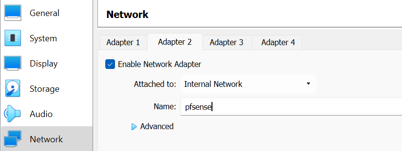

### Harddisk

**Velg Storage fra sidemenyen**

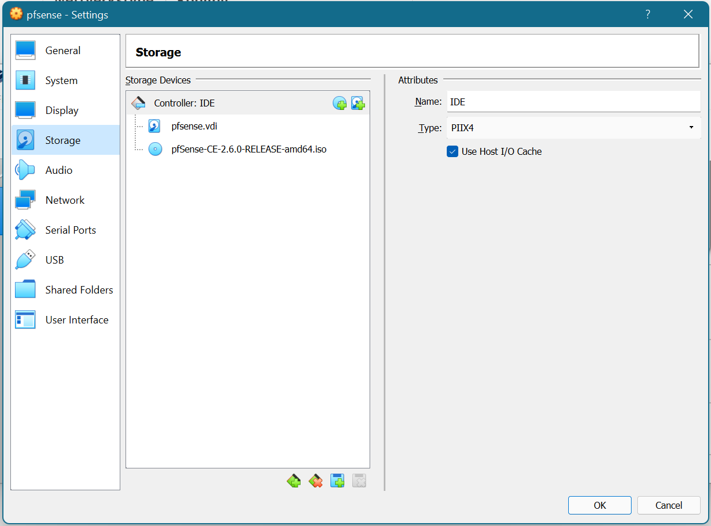

**Trykk harddisken med +**

**Trykk Create**

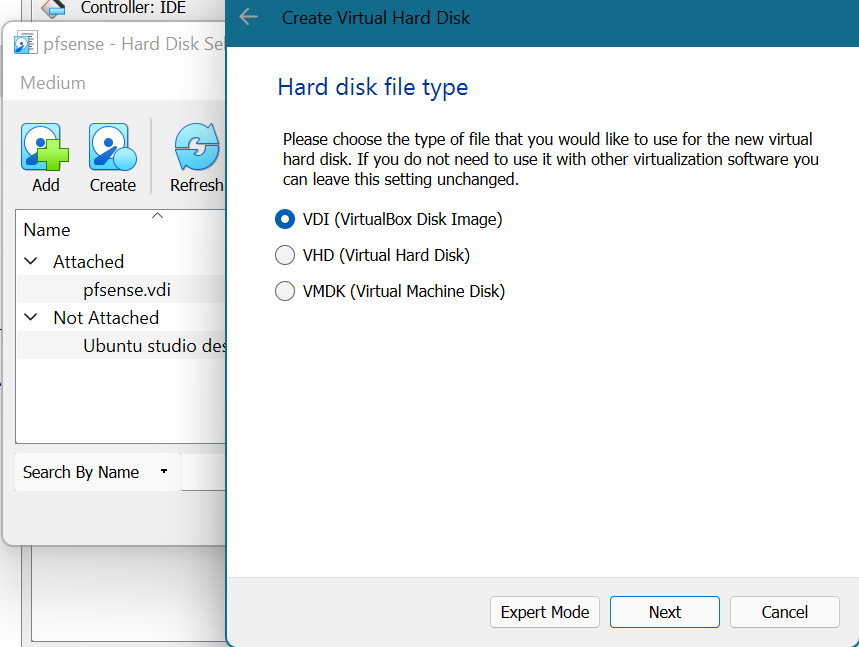

**Velg innstillingene du vil ha**

**Etter du er ferdig med å lage harddisken trykk Choose**

### Minne og kjerner

**Velg System fra sidemenyen**

**Velg hvor mye ram du skal ha**

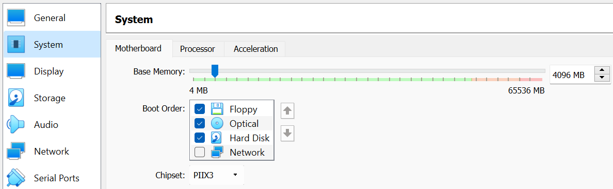

**Trykk Processor**

**Velg hvor mange kjerner du vil ha**

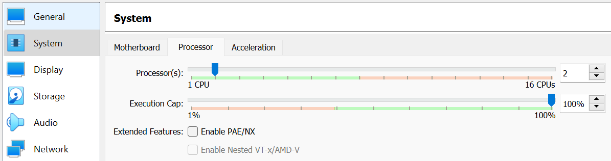
